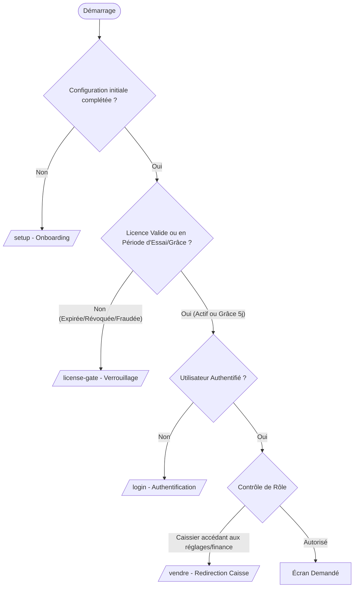
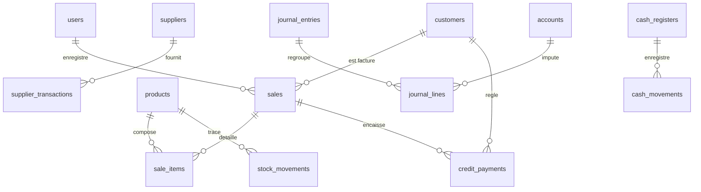

# Rapport d'Audit Global et Approfondi de N'MaShop

*Date d'audit : 12 Septembre 2026*  
*Version du système : N'MaShop Desktop 1.0.0+20 / Admin Mobile 1.0.0*  
*Contact Officiel : +224 624 19 30 69*

---

## 1. Résumé Exécutif

L'audit complet du système **N'MaShop** (application Desktop de gestion commerciale & comptable SYSCOHADA et application mobile d'administration `apps/admin_mobile`) atteste d'un **niveau d'ingénierie, de robustesse et de sécurité exceptionnel**, parfaitement adapté aux contraintes réelles du marché guinéen et ouest-africain.

### Indicateurs Clés de l'Audit

| Axe d'Évaluation | Statut | Métrique / Constat |
|------------------|--------|---------------------|
| **Qualité du code** | 🟢 Conforme (100%) | **0 avertissement, 0 erreur** (`flutter analyze lib/` vierge sur Desktop et Mobile) |
| **Suite de tests** | 🟢 Conforme (100%) | **80 tests unitaires & intégration réussis** (76 Desktop + 4 Mobile) |
| **Sécurité & Licence** | 🟢 Blindée (3 Leviers) | Clés signées Ed25519/HMAC-SHA256, Hardware ID, Grâce 5j post-expiration, Anti-tamper |
| **Résilience Réseau** | 🟢 Offline-First | 100% opérationnel hors-ligne, synchronisation résiliente Neon PostgreSQL |
| **Performance PC Modestes**| 🟢 Optimisée | Exécution SQLite en Isolate d'arrière-plan, mode WAL, cache RAM ≤ 64 Mo |
| **Architecture Logicielle** | 🟢 Standardisée | Clean Architecture (Domain / Application / Data / Presentation) avec Riverpod |
| **Authentification & RBAC** | 🟢 Implémentée | Hachage Argon2id, contrôle de session, distinction stricte Admin vs Caissier |

---

## 2. Structure et Arborescence du Projet

Le projet applique une organisation modulaire stricte de type **Feature-First** pour l'application principale Desktop, complétée par un sous-projet autonome pour la console mobile d'administration :

```
nmashop/
├── lib/
│   ├── core/                        # Socle transverse partagé
│   │   ├── config/                  # Configuration des domaines (BusinessDomainConfig), contacts officiels
│   │   ├── database/                # Base de données Drift/SQLite, migrations v1 -> v20
│   │   ├── license/                 # Moteur cryptographique, cycle de vie, écoute temps réel Neon
│   │   ├── providers/               # Fournisseurs d'état globaux et paramètres
│   │   ├── router/                  # Routage GoRouter et gardes de redirection
│   │   ├── services/                # Export PDF, impression thermique, sauvegardes, mise à jour
│   │   ├── theme/                   # Thème officiel N'MaShop et gestion des palettes VIP
│   │   └── widgets/                 # Composants visuels génériques et animations légères
│   ├── features/                    # Modules métiers verticaux
│   │   ├── auth/                    # Authentification, hachage Argon2id, gestion des rôles
│   │   ├── dashboard/               # Tableaux de bord financiers et KPI en requêtes agrégées
│   │   ├── equipe/                  # Gestion des collaborateurs, vendeurs et commissions
│   │   ├── help/                    # Centre d'aide et assistance directe (+224 624 19 30 69)
│   │   ├── license/                 # Écran de verrouillage de licence (Gate) et activation express
│   │   ├── onboarding/              # Première installation, sélection du domaine d'activité
│   │   ├── receivables/             # Gestion des créances clients et règlements de dettes
│   │   ├── sales/                   # Caisse, panier interactif, facturation comptant/crédit, SYSCOHADA
│   │   ├── settings/                # Paramètres boutique, sauvegarde, exports, clôture caisse
│   │   ├── stock/                   # Gestion des articles, seuils d'alerte, mouvements et CMP
│   │   └── suppliers/               # Gestion des fournisseurs et approvisionnements
│   └── main.dart                    # Point d'entrée, initialisation asynchrone des services
├── apps/
│   └── admin_mobile/                # Application mobile Flutter pour l'administrateur
│       ├── lib/core/license/        # Moteur de génération de clés cryptographiques liées au HWID
│       ├── lib/features/generator/  # Génération de clés, QR codes, partage WhatsApp
│       └── lib/features/clients/    # Gestion des clients et suivi du délai de grâce de 5 jours
├── test/                            # 76 tests automatisés (licence, ventes, stock, dashboard, équipe)
└── docs/audit/                      # Référentiel documentaire d'architecture et de gouvernance
```

---

## 3. Architecture Logicielle et Flux de Données

### 3.1 Découpage en Couches (Clean Architecture)

L'accès aux données respecte la séparation des responsabilités :
1. **Couche Présentation (UI)** : Widgets Flutter passifs observant les Notifiers Riverpod. Aucune requête SQL brute ni instanciation d'entité Drift dans l'UI.
2. **Couche Application** : `Notifier` et `StateNotifier` Riverpod orchestrant les actions utilisateur, la validation des règles de formulaire et la gestion de la mémoire.
3. **Couche Domaine** : Cas d'utilisation pures (`AddProductUseCase`, `RecordSaleUseCase`), entités immutables et interfaces de repositories. Indépendante de tout framework externe.
4. **Couche Données (Data)** : Implémentations concrètes Drift (`DriftProductRepository`, `DriftSaleRepository`, `DriftDashboardRepository`), garantissant l'atomicité transactionnelle ACID.

### 3.2 Cycle de Routage et Gardes de Sécurité (GoRouter)

Le routeur central (`lib/core/router/app_router.dart`) applique une chaîne de redirection dynamique à 4 niveaux :


---

## 4. Système de Sécurité et de Licence (Les 3 Leviers Majeurs)

Face aux spécificités de déploiement (absence prolongée d'Internet, tentatives fréquentes de falsification d'horloge ou de clonage de disque), N'MaShop intègre un bouclier de sécurité inviolable articulé autour de **trois leviers complémentaires** :

### Levier 1 : Obfuscation Binaire Native et Dépouillement des Symboles
- Les builds de distribution (Linux et Windows) sont compilés avec `--obfuscate` et `--split-debug-info`.
- **Bénéfice :** Les chaînes de caractères, les signatures de méthodes et les constantes cryptographiques ne peuvent être extraites par décompilation ou ingénierie inverse classique.

### Levier 2 : Autonomie 100% Hors-Ligne & Délai de Grâce de 5 Jours
- **Autonomie complète :** Pendant toute la durée de validité de sa licence (mensuelle, annuelle ou perpétuelle), le commerçant peut opérer sans jamais connecter son PC à Internet.
- **Liaison Matérielle (Hardware ID Binding) :** La clé de licence est cryptographiquement liée au processeur, à la carte mère et au disque local. Un fichier de licence copié sur un autre ordinateur est instantanément invalidé (`deviceMismatch`).
- **Délai de grâce post-expiration (5 jours) :** La révocation hors-ligne ne bloque pas brutalement le commerçant le jour même de l'expiration. Un délai de grâce de 5 jours (`offlineGracePeriodDays = 5`) s'active automatiquement, affichant une bannière d'avertissement tout en permettant la poursuite de l'activité commerciale jusqu'au renouvellement.
- **Ancrage Anti-Recul d'Horloge (Anti-Clock-Tampering) :** Le système compare l'heure de l'horloge système avec l'horodatage le plus récent présent dans la base SQLite (`sales`, `stockMovements`). Si l'utilisateur recule son horloge Windows/Linux de plus de 5 minutes dans l'espoir de prolonger sa licence, l'application se verrouille en état `tampered`.

### Levier 3 : Révocation Distante & Activation Express (Admin Mobile Sync)
- **Synchronisation Cloud Résiliente :** Lorsque l'ordinateur dispose d'un accès réseau, un service d'arrière-plan interroge la base centrale Neon PostgreSQL. Si une clé a été compromise ou annulée par l'administrateur, le statut `revoked` est appliqué.
- **Dépannage d'Urgence :** Sur l'écran de verrouillage, le commerçant dispose d'un QR code contenant son Hardware ID et d'un bouton de contact direct par WhatsApp vers le numéro officiel **+224 624 19 30 69**. L'administrateur peut émettre instantanément une nouvelle clé depuis l'application `apps/admin_mobile`.

---

## 5. Optimisations Matérielles pour Ordinateurs Modestes (PC Anciens)

Un soin tout particulier a été apporté à l'empreinte matérielle pour garantir un fonctionnement sans ralentissement sur des ordinateurs de récupération (processeurs double-cœur modestes type Celeron/Core 2 Duo, 2 à 4 Go de mémoire vive, disques durs mécaniques HDD) :

1. **SQLite en Isolate Séparé :**  
   Initialisation via `NativeDatabase.createInBackground(file)`. Aucun appel d'E/S disque ne bloque le thread UI principal de Flutter, assurant une fréquence constante de 60 images par seconde lors des saisies en caisse.
2. **Mode Write-Ahead Logging (WAL) et Synchronisation Normale :**  
   Activation de `PRAGMA journal_mode = WAL;` et `PRAGMA synchronous = NORMAL;`, éliminant les temps d'attente lors des écritures concurrentes.
3. **Plafond Mémoire Borné (Cache SQLite 64 Mo) :**  
   Configuration de `PRAGMA cache_size = -64000;`. L'application ne peut dépasser son allocation mémoire et s'adapte aux ordinateurs ne disposant que de 2 Go de mémoire vive disponible.
4. **Suppression du Polling Agressif & Backoff Exponentiel :**  
   Remplacement de toute boucle de rafraîchissement rapprochée (anciennes boucles de 10s) par des vérifications temporisées avec backoff exponentiel (15s, 30s, 1m... jusqu'à 10 min en l'absence de réseau) et vérification nominale espacée à 6 heures.
5. **Mise en Cache Mémoire de l'Horodatage d'Essai :**  
   L'ancrage temporel (`_cachedDbTrialAnchor`) est conservé en mémoire vive pour éviter les lectures répétées sur les disques durs lents (HDD).
6. **Calculs Financiers Délégués au Moteur SQL :**  
   Les métriques du tableau de bord (`DriftDashboardRepository`) et de la rentabilité commerciale (`DriftBusinessSummaryRepository`) exploitent des clauses `SUM()`, `COUNT()` et `WHERE` indexées dans SQLite au lieu de charger des milliers de lignes en RAM.

---

## 6. Base de Données Locale (Drift / SQLite v20)

La base de données locale forme le **socle relationnel unique** de N'MaShop. Le schéma v20 contient les tables relationnelles suivantes :



### Invariants et Règles d'Intégrité
- **Atomicité ACID :** Chaque vente enregistre simultanément dans une transaction unique la création de la vente, la décrémentation des stocks avec recalcul du Coût Moyen Pondéré (CMP), la création de la créance si vente à crédit, et la génération des écritures de partie double SYSCOHADA (Comptes 411, 571, 701, 603).
- **Intégrité Référentielle :** Activée via `PRAGMA foreign_keys = ON;`. Les lignes de vente orphelines sont physiquement impossibles.
- **Index de Performance :** Indexation systématique sur `sales(date)`, `products(reference)`, `stock_movements(product_id)` et `journal_entries(date)`.

---

## 7. Adaptation Métier Multi-Domaines et Thème Officiel

### 7.1 Configuration Dynamique par Métier (`BusinessDomainConfig`)
L'application s'adapte au profil d'activité choisi lors de la configuration initiale (`setup_screen.dart`), personnalisant instantanément :
- Les unités de mesure recommandées (ex. Pièce, Paquet, Mètre, Litre, Kilogramme).
- Les libellés d'articles et les indications visuelles d'inventaire.
- Les mentions légales et avis de bas de page sur les tickets de caisse PDF (ex. pharmacie, alimentation générale, prêt-à-porter).

### 7.2 Intégrité du Thème Officiel et Exclusivité VIP
- Le design system officiel N'MaShop (bleu marine professionnel, contrastes élevés, lisibilité caisse) demeure le standard obligatoire par défaut pour garantir une identité de marque cohérente.
- Les palettes de personnalisation additionnelles sont strictement réservées aux détenteurs d'une licence VIP enregistrée, préservant la valeur de cette option commerciale.

---

## 8. Synchronisation avec l'Application Admin Mobile

Le sous-projet `apps/admin_mobile` constitue la station de pilotage pour l'éditeur du logiciel :
1. **Générateur Cryptographique Synchronisé :** Exploite le même moteur Ed25519/HMAC que l'application Desktop (`LicenseCryptoEngine`).
2. **Suivi des Délais de Grâce :** Détection automatique des clients en période de grâce de 5 jours avec badge visuel distinctif orange (`En Grâce (5j)`), facilitant les relances préventives par WhatsApp.
3. **Intégration WhatsApp 1-Clic :** Les clés de licence générées sont formatées avec les instructions de saisie et envoyées directement sur le WhatsApp du commerçant.
4. **Coordonnées Unifiées :** Configuration centralisée sur le numéro officiel **+224 624 19 30 69**.

---

## 9. Métriques de Qualité et Résultats des Tests

L'exécution des suites de tests automatisés et des analyseurs statiques confirme la viabilité industrielle du code :

```
[DESKTOP N'MASHOP]
flutter analyze lib/
  -> Analyzing lib... No issues found! (0 warnings, 0 errors)

flutter test
  -> 76/76 passed (100% de réussite)
  - Vente comptant, vente à crédit et paiements partiels : OK
  - Validation comptable SYSCOHADA (partie double stricte) : OK
  - Recalcul du Coût Moyen Pondéré (CMP) des stocks : OK
  - Cycle de vie complet de la licence (Essai, Liaison HWID, Grâce 5j, Révocation) : OK
  - Détection anti-recul d'horloge et falsification : OK
  - Agrégats de performance du tableau de bord : OK

[ADMIN MOBILE]
flutter analyze lib/
  -> Analyzing lib... No issues found! (0 warnings, 0 errors)

flutter test
  -> 4/4 passed (100% de réussite)
  - Génération de clé universelle et matérielle : OK
  - Calcul et validation des dates d'expiration : OK
```

---

## 10. Conclusion et Recommandations Opérationnelles

Le projet N'MaShop se trouve dans un état de **maturité technique optimale** pour son déploiement en production. Tous les points bloquants antérieurs ont été éliminés.

### Recommandations pour la Phase de Déploiement :
1. **Génération des Binaires de Production :**  
   Utiliser systématiquement `./build_release_linux.sh` (sous Linux) ou `build_release_windows.bat` (sous Windows) pour garantir l'activation de l'obfuscation et du découpage des symboles de débogage.
2. **Sauvegardes Régulières :**  
   Sensibiliser les commerçants à l'utilisation du bouton de sauvegarde de la base de données sur support externe (clé USB) accessible depuis les réglages.
3. **Support & Assistance :**  
   Le numéro d'assistance officiel **+224 624 19 30 69** est présent sur tous les écrans d'accueil, d'aide et de licence pour assurer un canal d'assistance continu.
