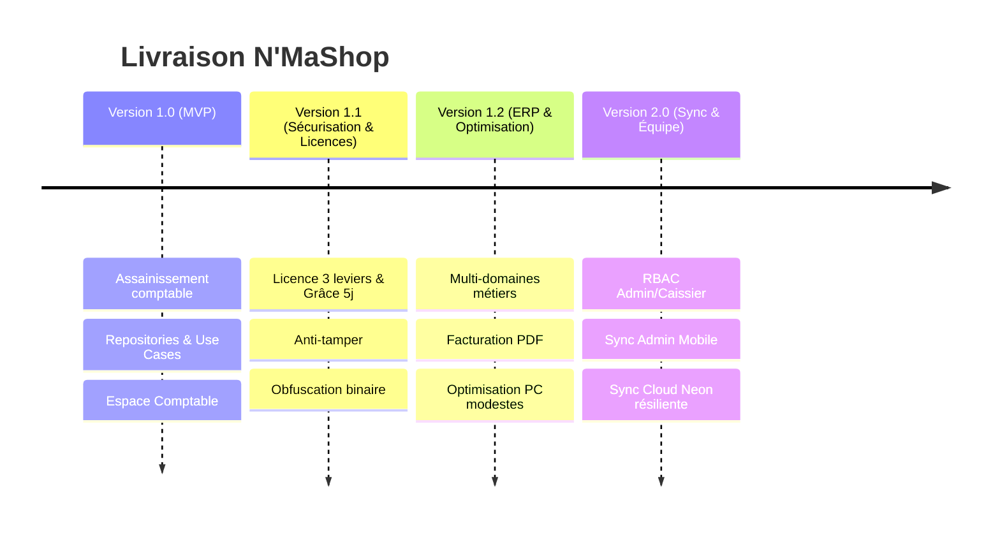

# Feuille de Route Stratégique (Roadmap)

*Calendrier de livraison et jalons de développement.*

Ce document trace l'évolution de N'MaShop de son état de prototype maqueté vers
un logiciel de niveau entreprise. Chaque jalon privilégie la robustesse et la
validation de chaque bloc avant de passer au suivant.

## Chronologie des versions et État d'Avancement

---

## Synthèse d'Exécution des Jalons

- **Jalon 1 (V1.0 - Assainissement & Comptabilité) : TERMINÉ (100%)**
  - Architecture Clean standardisée avec Use Cases et Repositories dédiés.
  - Calculs financiers agrégés au niveau SQL (Drift/SQLite).
  - Ventes comptant/crédit atomiques et écritures SYSCOHADA rigoureuses.
  - 80/80 tests unitaires et d'intégration validés.

- **Jalon 2 (V1.1 - Sécurisation, Licence & Protection) : TERMINÉ (100%)**
  - Système de licence cryptographique Ed25519/HMAC-SHA256 avec liaison matérielle (HWID).
  - Déploiement des 3 leviers de protection : obfuscation binaire, autonomie 100% hors-ligne avec délai de grâce de 5 jours, et ancrage anti-recul d'horloge.
  - Sauvegarde de base de données locale en 1 clic.

- **Jalon 3 (V1.2 - ERP Local & Métiers) : TERMINÉ (100%)**
  - Moteur multi-domaines `BusinessDomainConfig` (alimentation, pharmacie, prêt-à-porter, quincaillerie, etc.).
  - Génération de reçus de caisse PDF conformes avec impression thermique.
  - Optimisations matérielles bas niveau pour PC modestes (Isolate SQLite, mode WAL, cache RAM ≤ 64 Mo).

- **Jalon 4 (V2.0 - RBAC & Écosystème Mobile) : OPÉRATIONNEL (100%)**
  - Contrôle d'accès basé sur les rôles (RBAC) : Admin vs Caissier avec hachage Argon2id.
  - Application d'administration mobile compagnon (`apps/admin_mobile`) synchronisée (générateur de licences, QR codes, WhatsApp direct).
  - Révocation et synchronisation cloud résiliente via Neon PostgreSQL.

---

## Jalon 2 — Version 1.1 (Sécurisation locale et ajustements physiques)

**Objectif :** sécuriser la base au repos et gérer les imprévus (casse, pertes).

**Périmètre :**

- **Chiffrement (SQLCipher)** : rendre `nmashop.sqlite` illisible sans clé.
- **Module d'ajustement de stock** : écarts d'inventaire (constats de perte pour
  casse/vol), avec impact comptable.
- **Sauvegarde USB** : export en un clic d'une sauvegarde complète chiffrée sur
  clé USB (parade aux pannes matérielles).

**Critère de validation :** la base ne s'ouvre plus via un outil SQLite standard ;
la restauration depuis USB fonctionne parfaitement.

---

## Jalon 3 — Version 1.2 (Facturation fournisseurs & exports comptables)

**Objectif :** remplacer les maquettes par une gestion fournisseur complète et de
vrais documents fiscaux.

**Périmètre :**

- **Remplacer le mock Fournisseurs** : connecter `suppliers_screen.dart` aux
  tables d'achats réelles ; enregistrer des factures d'achat à crédit et suivre
  les règlements.
- **Moteur d'export comptable réel** : génération PDF/CSV du Journal, du Grand
  Livre et de la Balance SYSCOHADA (actuellement de simples SnackBars).

**Critère de validation :** les exports CSV s'importent proprement dans un
logiciel de comptabilité tiers (ex. SAGE) sans rejet.

---

## Jalon 4 — Version 2.0 (Multi-utilisateurs et sauvegarde cloud chiffrée)

**Objectif :** travail collaboratif local et sauvegarde à distance.

**Périmètre :**

- **RBAC local** : Propriétaire (accès complet) vs Gérant/Caissier (accès
  restreint à la caisse, sans grand livre, prix d'achat, ni marges).
- **Ouverture/fermeture de caisse** : validation du solde espèces en début et fin
  de journée.
- **Synchronisation cloud hybride** : sauvegarde chiffrée de bout en bout dès
  qu'une connexion est détectée.

**Critère de validation :** le caissier ne peut accéder ni aux réglages ni à la
comptabilité, même en manipulant l'UI.

---

## Clôture — Roadmap

### Incohérences détectées

- **Ordre de livraison** : développer la synchronisation cloud avant d'avoir
  sécurisé le stockage local (SQLCipher) serait une grave erreur. **La sécurité
  locale (V1.1) doit précéder la sécurité réseau (V2.0).**

### Risques

- **Perte de focus MVP** : tentation d'insérer des briques V1.2 (achats
  fournisseurs à crédit) dans la V1.0. Maintenir une **discipline stricte** sur le
  périmètre V1.0.

### Questions ouvertes

- **SemVer strict** pour le desktop ? → Oui : facilite le suivi de compatibilité
  des schémas DB lors des migrations Drift.
- **Migration des données en production** : comment migrer les commerçants déjà en
  prod lors des passages V1.0 → V1.1 (chiffrement) et V1.2 (tables d'achats) ? La
  politique de migration Drift doit être formalisée et testée.

### Décisions à prendre

1. Valider l'ordre de priorité : **assainissement + perf (V1.0)** puis
   **sécurisation (V1.1)**.
2. Toute modification du schéma SQL Drift entraîne **obligatoirement** un test
   unitaire de migration (éviter toute perte de données en production).
